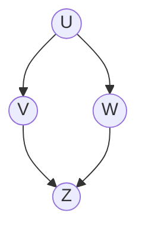
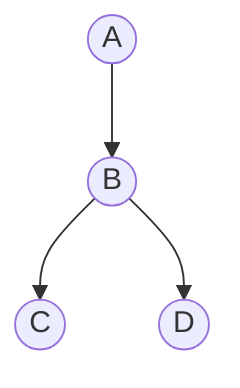

# GATE DA 2024 — Probability & Statistics PYQs

This file contains all the **Probability and Statistics** questions from:
1. **GATE 2024 Data Science and Artificial Intelligence (DA)** — Official Question Paper (Organizing Institute: IISc Bengaluru)
2. **GATE 2024 Data Science and Artificial Intelligence (DA)** — Official Sample Question Paper (IISc Bengaluru)

---

# Part 1: GATE DA 2024 (Official Paper)

---

### Question 3
- **Section:** General Aptitude (GA)
- **Question Type:** Multiple Choice Question (MCQ)
- **Marks:** 1
- **Topic:** Counting (Permutations & Combinations), Divisibility

**Question:**
How many 4-digit positive integers divisible by 3 can be formed using only the digits $\{1, 3, 4, 6, 7\}$, such that no digit appears more than once in a number?

(A) 24  
(B) 48  
(C) 72  
(D) 12  

**Answer:**
**(B) 48**

**Detailed Solution:**
A number is divisible by 3 if and only if the sum of its digits is divisible by 3.  
The given set of 5 digits is $\{1, 3, 4, 6, 7\}$.  
Sum of all 5 digits $= 1 + 3 + 4 + 6 + 7 = 21$.  
To form a 4-digit number without repetition, we must exclude exactly one digit:
- Total sum is $21$, which is divisible by 3.
- To keep the sum of the remaining 4 digits divisible by 3, the excluded digit must also be divisible by 3.
- The digits in the set divisible by 3 are **3** and **6**.

**Case 1: Exclude 3**  
The chosen 4 digits are $\{1, 4, 6, 7\}$.  
Sum $= 1 + 4 + 6 + 7 = 18$ (divisible by 3).  
Number of permutations $= 4! = 24$.

**Case 2: Exclude 6**  
The chosen 4 digits are $\{1, 3, 4, 7\}$.  
Sum $= 1 + 3 + 4 + 7 = 15$ (divisible by 3).  
Number of permutations $= 4! = 24$.

**Total 4-digit numbers** $= 24 + 24 = 48$.

---

### Question 7
- **Section:** General Aptitude (GA)
- **Question Type:** Multiple Choice Question (MCQ)
- **Marks:** 2
- **Topic:** Classical Probability, Binomial Distribution

**Question:**
The probability of a boy or a girl being born is $1/2$. For a family having only three children, what is the probability of having two girls and one boy?

(A) $3/8$  
(B) $1/8$  
(C) $1/4$  
(D) $1/2$  

**Answer:**
**(A) 3/8**

**Detailed Solution:**
Let $n = 3$ children.  
Probability of a girl $p = 1/2$, probability of a boy $q = 1/2$.  
The number of girls $X$ follows a Binomial distribution: $X \sim \text{Binomial}(n=3, p=1/2)$.  
$$P(X = 2) = \binom{3}{2} p^2 q^{3-2} = \binom{3}{2} \left(\frac{1}{2}\right)^2 \left(\frac{1}{2}\right)^1 = 3 \times \frac{1}{8} = \frac{3}{8}$$

Alternatively, the sample space of size $2^3 = 8$ is:  
$\{BBB, BBG, BGB, GBB, BGG, GBG, GGB, GGG\}$.  
The favorable outcomes with 2 girls and 1 boy are $\{BGG, GBG, GGB\}$ (3 outcomes).  
Therefore, the probability is $3/8$.

---

### Question 11
- **Section:** Data Science and Artificial Intelligence (DA)
- **Question Type:** Multiple Choice Question (MCQ)
- **Marks:** 1
- **Topic:** Poisson Distribution, Normal Distribution

**Question:**
Consider the following statements:
- (i) The mean and variance of a Poisson random variable are equal.
- (ii) For a standard normal random variable, the mean is zero and the variance is one.

Which ONE of the following options is correct?

(A) Both (i) and (ii) are true  
(B) (i) is true and (ii) is false  
(C) (ii) is true and (i) is false  
(D) Both (i) and (ii) are false  

**Answer:**
**(A) Both (i) and (ii) are true**

**Detailed Solution:**
- Statement (i): For a Poisson random variable $X \sim \text{Poisson}(\lambda)$, the expected value $E[X] = \lambda$ and the variance $\text{Var}(X) = \lambda$. Hence, mean and variance are equal. Statement (i) is **True**.
- Statement (ii): By definition, a standard normal random variable $Z \sim \mathcal{N}(0, 1)$ has mean $\mu = 0$ and variance $\sigma^2 = 1$. Statement (ii) is **True**.

---

### Question 12
- **Section:** Data Science and Artificial Intelligence (DA)
- **Question Type:** Multiple Choice Question (MCQ)
- **Marks:** 1
- **Topic:** Independent Events, Mutually Exclusive Events

**Question:**
Three fair coins are tossed independently. $T$ is the event that two or more tosses result in heads. $S$ is the event that two or more tosses result in tails.

What is the probability of the event $T \cap S$?

(A) 0  
(B) 0.5  
(C) 0.25  
(D) 1  

**Answer:**
**(A) 0**

**Detailed Solution:**
When tossing three fair coins, the total number of tosses is 3.  
- Event $T$: "Two or more tosses result in heads" $\implies$ Number of heads $\ge 2$, meaning outcomes with 2 or 3 heads: $\{HHT, HTH, THH, HHH\}$.
- Event $S$: "Two or more tosses result in tails" $\implies$ Number of tails $\ge 2$, meaning at most 1 head: $\{TTH, THT, HTT, TTT\}$.

Notice that $T$ requires at least 2 heads, while $S$ requires at least 2 tails (which means at most 1 head).  
Since a toss of 3 coins cannot simultaneously have at least 2 heads AND at least 2 tails:
$$T \cap S = \emptyset$$
Therefore, $P(T \cap S) = 0$.

---

### Question 20
- **Section:** Data Science and Artificial Intelligence (DA)
- **Question Type:** Multiple Choice Question (MCQ)
- **Marks:** 1
- **Topic:** Naïve Bayes Classifier, Parameter Estimation

**Question:**
Given a dataset with $K$ binary-valued attributes (where $K > 2$) for a two-class classification task, the number of parameters to be estimated for learning a naïve Bayes classifier is

(A) $2^K + 1$  
(B) $2K + 1$  
(C) $2^{K+1} + 1$  
(D) $K^2 + 1$  

**Answer:**
**(B) $2K + 1$**

**Detailed Solution:**
For a Naïve Bayes classifier with a 2-class problem ($Y \in \{c_1, c_2\}$) and $K$ binary features ($X_1, X_2, \dots, X_K \in \{0, 1\}$):
1. **Class Prior $P(Y)$:**  
   Since there are 2 classes and $P(Y = c_1) + P(Y = c_2) = 1$, we only need to estimate **1 independent parameter** (e.g., $P(Y = c_1)$).
2. **Conditional Probabilities $P(X_i | Y)$:**  
   By the Naïve Bayes conditional independence assumption:
   $$P(X_1, \dots, X_K | Y = c) = \prod_{i=1}^K P(X_i | Y = c)$$
   For each feature $X_i$ and each class $c \in \{c_1, c_2\}$, since $X_i$ is binary, $P(X_i = 1 | Y = c) + P(X_i = 0 | Y = c) = 1$.  
   Thus, for each class, each feature requires **1 parameter**: $P(X_i = 1 | Y = c)$.  
   For 2 classes and $K$ features: $2 \times K = 2K$ parameters.

**Total parameters to estimate:**  
$$2K + 1$$

---

### Question 24
- **Section:** Data Science and Artificial Intelligence (DA)
- **Question Type:** Multiple Choice Question (MCQ)
- **Marks:** 1
- **Topic:** Joint Distribution, Conditional Independence, Bayesian Networks

**Question:**
Consider five random variables $U, V, W, X,$ and $Y$ whose joint distribution satisfies:
$$P(U, V, W, X, Y) = P(U) P(V) P(W | U, V) P(X | W) P(Y | W)$$

Which ONE of the following statements is FALSE?

(A) $Y$ is conditionally independent of $V$ given $W$  
(B) $X$ is conditionally independent of $U$ given $W$  
(C) $U$ and $V$ are conditionally independent given $W$  
(D) $Y$ and $X$ are conditionally independent given $W$  

**Answer:**
**(C) $U$ and $V$ are conditionally independent given $W$**

**Detailed Solution:**
The factorization corresponds to a Bayesian Directed Acyclic Graph (DAG):
- $U$ and $V$ are independent parents with no incoming edges: $P(U)$, $P(V)$.
- $W$ has incoming edges from $U$ and $V$: $U \to W \leftarrow V$ (a **v-structure** or collider at $W$).
- $X$ and $Y$ have incoming edges from $W$: $W \to X$ and $W \to Y$.

Let us analyze conditional independence using d-separation:
- **(A)** Path from $Y$ to $V$: $Y \leftarrow W \leftarrow V$. Given $W$, this causal chain is blocked. Thus, $Y \perp V \mid W$. (TRUE)
- **(B)** Path from $X$ to $U$: $X \leftarrow W \leftarrow U$. Given $W$, this causal chain is blocked. Thus, $X \perp U \mid W$. (TRUE)
- **(C)** $U$ and $V$ meet at the collider $W$ ($U \to W \leftarrow V$). Unconditioned, $U$ and $V$ are marginally independent ($U \perp V$). However, conditioning on the collider $W$ **activates** the path between $U$ and $V$ (explaining away). Hence, $U$ and $V$ are **conditionally dependent** given $W$ ($U \not\perp V \mid W$). Thus, statement (C) is **FALSE**.
- **(D)** Path from $X$ to $Y$: $X \leftarrow W \to Y$ (fork at $W$). Conditioning on $W$ blocks the path. Thus, $X \perp Y \mid W$. (TRUE)

---

### Question 27
- **Section:** Data Science and Artificial Intelligence (DA)
- **Question Type:** Multiple Choice Question (MCQ)
- **Marks:** 1
- **Topic:** Descriptive Statistics, Z-Score Normalization

**Question:**
Let the minimum, maximum, mean and standard deviation values for the attribute income of data scientists be ₹46000, ₹170000, ₹96000, and ₹21000, respectively. The z-score normalized income value of ₹106000 is closest to which ONE of the following options?

(A) 0.217  
(B) 0.476  
(C) 0.623  
(D) 2.304  

**Answer:**
**(B) 0.476**

**Detailed Solution:**
The z-score normalization formula is:
$$z = \frac{x - \mu}{\sigma}$$
Given:
- Value $x = 106000$
- Mean $\mu = 96000$
- Standard deviation $\sigma = 21000$

Calculating:
$$z = \frac{106000 - 96000}{21000} = \frac{10000}{21000} = \frac{10}{21} \approx 0.47619$$

---

### Question 34
- **Section:** Data Science and Artificial Intelligence (DA)
- **Question Type:** Numerical Answer Type (NAT)
- **Marks:** 1
- **Topic:** Descriptive Statistics, Sample Mean

**Question:**
The sample average of 50 data points is 40. The updated sample average after including a new data point taking the value of 142 is ______.

**Answer:**
**42** (Answer range: 42 to 42)

**Detailed Solution:**
- Initial sample size $n = 50$, initial mean $\bar{x}_{50} = 40$.
- Initial sum of observations:
  $$\sum_{i=1}^{50} x_i = 50 \times 40 = 2000$$
- A new 51st data point $x_{51} = 142$ is added.
- New sum of observations:
  $$\sum_{i=1}^{51} x_i = 2000 + 142 = 2142$$
- Updated sample average:
  $$\bar{x}_{51} = \frac{2142}{51} = 42$$

---

### Question 36
- **Section:** Data Science and Artificial Intelligence (DA)
- **Question Type:** Multiple Choice Question (MCQ)
- **Marks:** 2
- **Topic:** Expected Value, Geometric Trials, Markov Chains

**Question:**
A fair six-sided die (with faces numbered 1, 2, 3, 4, 5, 6) is repeatedly thrown independently.

What is the expected number of times the die is thrown until two consecutive throws of even numbers are seen?

(A) 2  
(B) 4  
(C) 6  
(D) 8  

**Answer:**
**(C) 6**

**Detailed Solution:**
On each throw of a fair 6-sided die, the probability of an even number $\{2, 4, 6\}$ is $p = 3/6 = 1/2$, and an odd number is $q = 1/2$.  
We want the expected number of throws to observe the pattern **EE** (two consecutive evens).

We can model this using a Markov Chain with states:
- State 0: Start / last roll was odd (0 consecutive evens). Let $E_0$ be the expected remaining throws from State 0.
- State 1: Last roll was even, but not preceded by an even (1 consecutive even). Let $E_1$ be the expected remaining throws from State 1.
- State 2: Two consecutive evens reached (Absorption). Remaining throws = 0.

From State 0:
- With probability $1/2$, we throw an even number and move to State 1.
- With probability $1/2$, we throw an odd number and stay in State 0.
$$E_0 = 1 + \frac{1}{2} E_1 + \frac{1}{2} E_0 \implies \frac{1}{2} E_0 = 1 + \frac{1}{2} E_1 \implies E_0 = 2 + E_1$$

From State 1:
- With probability $1/2$, we throw an even number and reach State 2 (done).
- With probability $1/2$, we throw an odd number and return to State 0.
$$E_1 = 1 + \frac{1}{2}(0) + \frac{1}{2} E_0 = 1 + \frac{1}{2} E_0$$

Substitute $E_1$ into the equation for $E_0$:
$$E_0 = 2 + \left(1 + \frac{1}{2} E_0\right) = 3 + \frac{1}{2} E_0$$
$$\frac{1}{2} E_0 = 3 \implies E_0 = 6$$

---

### Question 56
- **Section:** Data Science and Artificial Intelligence (DA)
- **Question Type:** Numerical Answer Type (NAT)
- **Marks:** 2
- **Topic:** Continuous Random Variables, Uniform Distribution, Joint Probability

**Question:**
Let $X$ be a random variable uniformly distributed in the interval $[1, 3]$ and $Y$ be a random variable uniformly distributed in the interval $[2, 4]$. If $X$ and $Y$ are independent of each other, the probability $P(X \ge Y)$ is ______ (rounded off to three decimal places).

**Answer:**
**0.125** (Answer range: 0.125 to 0.125)

**Detailed Solution:**
Given independent random variables:
- $X \sim U[1, 3] \implies f_X(x) = \frac{1}{3 - 1} = \frac{1}{2}$ for $1 \le x \le 3$.
- $Y \sim U[2, 4] \implies f_Y(y) = \frac{1}{4 - 2} = \frac{1}{2}$ for $2 \le y \le 4$.

Since $X$ and $Y$ are independent, their joint probability density function is:
$$f_{X,Y}(x, y) = f_X(x) f_Y(y) = \frac{1}{2} \times \frac{1}{2} = \frac{1}{4} \quad \text{for } 1 \le x \le 3, \; 2 \le y \le 4$$

We want to find $P(X \ge Y)$:
The condition $x \ge y$ requires $y \le x$.  
Since $y \ge 2$, $x$ must also satisfy $x \ge 2$.  
Therefore, the region of integration is:
$$2 \le x \le 3 \quad \text{and} \quad 2 \le y \le x$$

Integrating the joint PDF:
$$P(X \ge Y) = \int_{x=2}^3 \int_{y=2}^x \frac{1}{4} \, dy \, dx = \frac{1}{4} \int_2^3 (x - 2) \, dx$$
$$= \frac{1}{4} \left[ \frac{(x - 2)^2}{2} \right]_2^3 = \frac{1}{4} \left( \frac{1^2}{2} - 0 \right) = \frac{1}{8} = 0.125$$

---

### Question 57
- **Section:** Data Science and Artificial Intelligence (DA)
- **Question Type:** Numerical Answer Type (NAT)
- **Marks:** 2
- **Topic:** Exponential Distribution, Expectation, Variance

**Question:**
Let $X$ be a random variable exponentially distributed with parameter $\lambda > 0$. The probability density function of $X$ is given by:
$$f_X(x) = \begin{cases} \lambda e^{-\lambda x}, & x \ge 0 \\ 0, & \text{otherwise} \end{cases}$$

If $5 E(X) = \text{Var}(X)$, where $E(X)$ and $\text{Var}(X)$ indicate the expectation and variance of $X$, respectively, the value of $\lambda$ is ______ (rounded off to one decimal place).

**Answer:**
**0.2** (Answer range: 0.2 to 0.2)

**Detailed Solution:**
For an exponential random variable $X \sim \text{Exp}(\lambda)$:
- Expectation: $E[X] = \frac{1}{\lambda}$
- Variance: $\text{Var}(X) = \frac{1}{\lambda^2}$

Given the relationship:
$$5 E(X) = \text{Var}(X)$$
$$5 \left(\frac{1}{\lambda}\right) = \frac{1}{\lambda^2}$$

Since $\lambda > 0$, multiplying both sides by $\lambda^2$:
$$5\lambda = 1 \implies \lambda = \frac{1}{5} = 0.2$$

---

### Question 58
- **Section:** Data Science and Artificial Intelligence (DA)
- **Question Type:** Numerical Answer Type (NAT)
- **Marks:** 2
- **Topic:** Bayes' Theorem, Conditional Probability

**Question:**
Consider two events $T$ and $S$. Let $\bar{T}$ denote the complement of the event $T$. The probability associated with different events are given as follows:
$$P(\bar{T}) = 0.6, \quad P(S | T) = 0.3, \quad P(S | \bar{T}) = 0.6$$

Then, $P(T | S)$ is ______ (rounded off to two decimal places).

**Answer:**
**0.25** (Answer range: 0.25 to 0.25)

**Detailed Solution:**
From $P(\bar{T}) = 0.6$, the probability of $T$ is:
$$P(T) = 1 - P(\bar{T}) = 1 - 0.6 = 0.4$$

By the Law of Total Probability:
$$P(S) = P(S | T) P(T) + P(S | \bar{T}) P(\bar{T})$$
$$P(S) = (0.3)(0.4) + (0.6)(0.6) = 0.12 + 0.36 = 0.48$$

By Bayes' Theorem:
$$P(T | S) = \frac{P(S | T) P(T)}{P(S)} = \frac{0.12}{0.48} = \frac{1}{4} = 0.25$$

---

### Question 59
- **Section:** Data Science and Artificial Intelligence (DA)
- **Question Type:** Numerical Answer Type (NAT)
- **Marks:** 2
- **Topic:** Continuous Joint PDF, Conditional Expectation

**Question:**
Consider a joint probability density function of two random variables $X$ and $Y$:
$$f_{X,Y}(x, y) = \begin{cases} 2xy, & 0 < x < 2, \; 0 < y < x \\ 0, & \text{otherwise} \end{cases}$$

Then, $E[Y | X = 1.5]$ is ______.

**Official Final Key:**
**MTA (Marks to All)**

**Detailed Solution & Explanation for MTA:**
1. **Official Status:** IISc declared Marks to All (MTA) because the given function $f_{X,Y}(x, y)$ is not a valid probability density function:
   $$\int_0^2 \int_0^x 2xy \, dy \, dx = \int_0^2 x \left[ y^2 \right]_0^x \, dx = \int_0^2 x^3 \, dx = \left[ \frac{x^4}{4} \right]_0^2 = \frac{16}{4} = 4 \ne 1$$
   Since the total volume under the surface is 4 rather than 1, the function was improperly normalized by a factor of 4.

2. **Standard Mathematical Evaluation (if normalizing conditionally):**  
   If one proceeds using the definition of conditional density $f_{Y|X}(y|x) = \frac{f_{X,Y}(x, y)}{f_X(x)}$:
   - Marginal density of $X$:
     $$f_X(x) = \int_0^x 2xy \, dy = x \left[ y^2 \right]_0^x = x^3 \quad (0 < x < 2)$$
   - Conditional density of $Y$ given $X = x$:
     $$f_{Y|X}(y | x) = \frac{2xy}{x^3} = \frac{2y}{x^2} \quad (0 < y < x)$$
   - Conditional expectation:
     $$E[Y | X = x] = \int_0^x y \, f_{Y|X}(y|x) \, dy = \int_0^x y \cdot \frac{2y}{x^2} \, dy = \frac{2}{x^2} \int_0^x y^2 \, dy = \frac{2}{x^2} \left[ \frac{y^3}{3} \right]_0^x = \frac{2}{3} x$$
   - Substituting $x = 1.5$:
     $$E[Y | X = 1.5] = \frac{2}{3} \times 1.5 = 1.0$$

---

### Question 62
- **Section:** Data Science and Artificial Intelligence (DA)
- **Question Type:** Numerical Answer Type (NAT)
- **Marks:** 2
- **Topic:** Information Gain, Entropy, Decision Trees

**Question:**
Details of ten international cricket games between two teams “Green” and “Blue” are given in Table C. This table consists of matches played on different pitches, across formats along with their winners. The attribute Pitch can take one of two values: spin-friendly (represented as $S$) or pace-friendly (represented as $F$). The attribute Format can take one of two values: one-day match (represented as $O$) or test match (represented as $T$).

A cricket organization would like to use the information given in Table C to develop a decision-tree model to predict outcomes of future games between these two teams.

To develop such a model, the computed $\text{InformationGain}(C, \text{Pitch})$ with respect to the Target is ______ (rounded off to two decimal places).

#### Table C:
| Match Number | Pitch | Format | Winner (Target) |
|:---:|:---:|:---:|:---:|
| 1 | $S$ | $T$ | Green |
| 2 | $S$ | $T$ | Blue |
| 3 | $F$ | $O$ | Blue |
| 4 | $S$ | $O$ | Blue |
| 5 | $F$ | $T$ | Green |
| 6 | $F$ | $O$ | Blue |
| 7 | $S$ | $O$ | Green |
| 8 | $F$ | $T$ | Blue |
| 9 | $F$ | $O$ | Blue |
| 10 | $S$ | $O$ | Green |

**Answer:**
**0.12** (Answer range: 0.12 to 0.13)

**Detailed Solution:**
Total instances $N = 10$.  
Counts of Target (Winner):
- Green: matches 1, 5, 7, 10 $\implies 4$ matches.
- Blue: matches 2, 3, 4, 6, 8, 9 $\implies 6$ matches.

1. **Total Entropy $H(C)$:**
   $$H(C) = - \left( \frac{4}{10} \log_2 \frac{4}{10} + \frac{6}{10} \log_2 \frac{6}{10} \right)$$
   $$H(C) = - (0.4 \times (-1.3219) + 0.6 \times (-0.73696)) \approx 0.5288 + 0.4422 = 0.9710 \text{ bits}$$

2. **Split on attribute Pitch:**
   - **Pitch = $S$ (5 matches: 1, 2, 4, 7, 10):**
     - Green: 3 (matches 1, 7, 10)
     - Blue: 2 (matches 2, 4)
     $$H(C | \text{Pitch} = S) = - \left( \frac{3}{5} \log_2 \frac{3}{5} + \frac{2}{5} \log_2 \frac{2}{5} \right) = - (0.6 \log_2 0.6 + 0.4 \log_2 0.4) \approx 0.9710 \text{ bits}$$
   - **Pitch = $F$ (5 matches: 3, 5, 6, 8, 9):**
     - Green: 1 (match 5)
     - Blue: 4 (matches 3, 6, 8, 9)
     $$H(C | \text{Pitch} = F) = - \left( \frac{1}{5} \log_2 \frac{1}{5} + \frac{4}{5} \log_2 \frac{4}{5} \right) = - (0.2 \log_2 0.2 + 0.8 \log_2 0.8)$$
     $$= - (0.2 \times (-2.3219) + 0.8 \times (-0.3219)) = 0.4644 + 0.2575 = 0.7219 \text{ bits}$$

3. **Conditional Entropy $H(C | \text{Pitch})$:**
   $$H(C | \text{Pitch}) = \frac{5}{10} H(C | S) + \frac{5}{10} H(C | F) = 0.5(0.9710) + 0.5(0.7219) = 0.4855 + 0.3610 = 0.8465 \text{ bits}$$

4. **Information Gain:**
   $$\text{Gain}(C, \text{Pitch}) = H(C) - H(C | \text{Pitch}) = 0.9710 - 0.8465 = 0.1245 \approx 0.12$$

---

### Question 64
- **Section:** Data Science and Artificial Intelligence (DA)
- **Question Type:** Numerical Answer Type (NAT)
- **Marks:** 2
- **Topic:** Bayesian Networks, Joint Probability

**Question:**
Given the following Bayesian Network consisting of four Bernoulli random variables and the associated conditional probability tables:

#### Conditional Probability Tables:
- **Table for $U$:**
  | $U$ | $P(U)$ |
  |:---:|:---:|
  | $U = 0$ | 0.5 |
  | $U = 1$ | 0.5 |

- **Table for $V | U$:**
  | $U$ | $P(V = 0 | U)$ | $P(V = 1 | U)$ |
  |:---:|:---:|:---:|
  | $U = 0$ | 0.5 | 0.5 |
  | $U = 1$ | 0.5 | 0.5 |

- **Table for $W | U$:**
  | $U$ | $P(W = 0 | U)$ | $P(W = 1 | U)$ |
  |:---:|:---:|:---:|
  | $U = 0$ | 1.0 | 0.0 |
  | $U = 1$ | 0.0 | 1.0 |

- **Table for $Z | V, W$:**
  | $V$ | $W$ | $P(Z = 0 | V, W)$ | $P(Z = 1 | V, W)$ |
  |:---:|:---:|:---:|:---:|
  | $V = 0$ | $W = 0$ | 0.5 | 0.5 |
  | $V = 0$ | $W = 1$ | 1.0 | 0.0 |
  | $V = 1$ | $W = 0$ | 1.0 | 0.0 |
  | $V = 1$ | $W = 1$ | 0.5 | 0.5 |

The value of $P(U = 1, V = 1, W = 1, Z = 1) =$ ______ (rounded off to three decimal places).

**Answer:**
**0.125** (Answer range: 0.125 to 0.125)

**Detailed Solution:**
By the chain rule of Bayesian networks:
$$P(U, V, W, Z) = P(U) \cdot P(V | U) \cdot P(W | U) \cdot P(Z | V, W)$$

We evaluate for $U = 1, V = 1, W = 1, Z = 1$:
- $P(U = 1) = 0.5$
- $P(V = 1 | U = 1) = 0.5$
- $P(W = 1 | U = 1) = 1.0$
- $P(Z = 1 | V = 1, W = 1) = 0.5$

Multiplying these terms:
$$P(U = 1, V = 1, W = 1, Z = 1) = 0.5 \times 0.5 \times 1.0 \times 0.5 = 0.125$$

---

### Question 65
- **Section:** Data Science and Artificial Intelligence (DA)
- **Question Type:** Numerical Answer Type (NAT)
- **Marks:** 2
- **Topic:** Indicator Random Variables, Covariance

**Question:**
Two fair coins are tossed independently. $X$ is a random variable that takes a value of 1 if both tosses are heads and 0 otherwise. $Y$ is a random variable that takes a value of 1 if at least one of the tosses is heads and 0 otherwise.

The value of the covariance of $X$ and $Y$ is ______ (rounded off to three decimal places).

**Answer:**
**0.0625** (Answer range: 0.062 to 0.063)

**Detailed Solution:**
Let the outcomes of the two independent coin tosses be $\{HH, HT, TH, TT\}$, each with probability $1/4$.
- $X = 1$ if outcome is $HH$, else $0$.
  $$P(X = 1) = P(HH) = \frac{1}{4} = 0.25 \implies E[X] = \frac{1}{4}$$
- $Y = 1$ if at least one head ($\{HH, HT, TH\}$), else $0$.
  $$P(Y = 1) = \frac{3}{4} = 0.75 \implies E[Y] = \frac{3}{4}$$

Now find the product $XY$:
- $XY = 1$ if and only if $X = 1$ and $Y = 1$.
- Since $X = 1 \implies HH$, which already implies at least one head ($Y = 1$), whenever $X = 1$, $Y$ is automatically $1$.
- Therefore, $XY = 1$ if and only if the outcome is $HH$.
$$E[XY] = P(X = 1, Y = 1) = P(HH) = \frac{1}{4}$$

Now calculate the covariance:
$$\text{Cov}(X, Y) = E[XY] - E[X]E[Y] = \frac{1}{4} - \left(\frac{1}{4} \times \frac{3}{4}\right) = \frac{1}{4} - \frac{3}{16} = \frac{1}{16} = 0.0625$$

---
---

# Part 2: GATE DA 2024 (Official Sample Paper by IISc)

---

### Sample Question 4
- **Question Type:** Multiple Choice Question (MCQ)
- **Marks:** 1
- **Topic:** Descriptive Statistics, Sample Mean

**Question:**
The mean of the observations of the first 50 observations of a process is 12. If the 51st observation is 18, then, the mean of the first 51 observations of the process, rounded off to two decimal places is ______ .

(A) 12.01  
(B) 12.12  
(C) 12.36  
(D) 18.18  

**Answer:**
**(B) 12.12**

**Detailed Solution:**
- Sum of first 50 observations $= 50 \times 12 = 600$.
- With the 51st observation added, the new sum $= 600 + 18 = 618$.
- New mean $= \frac{618}{51} \approx 12.1176 \approx 12.12$.

---

### Sample Question 7
- **Question Type:** Multiple Choice Question (MCQ)
- **Marks:** 1
- **Topic:** Conditional Probability

**Question:**
A fair coin is flipped twice, and it is given that at least one tail has been observed. The probability of getting two tails is

(A) $\frac{1}{2}$  
(B) $\frac{1}{3}$  
(C) $\frac{2}{3}$  
(D) $\frac{1}{4}$  

**Answer:**
**(B) 1/3**

**Detailed Solution:**
Sample space $S = \{HH, HT, TH, TT\}$, each outcome with probability $1/4$.  
- Condition event $A$ (at least one tail): $A = \{HT, TH, TT\}$ ($|A| = 3$).
- Target event $B$ (two tails): $B = \{TT\}$.
- Since $B \subset A$, $A \cap B = \{TT\}$.
$$P(B | A) = \frac{P(A \cap B)}{P(A)} = \frac{1/4}{3/4} = \frac{1}{3}$$

---

### Sample Question 8
- **Question Type:** Multiple Choice Question (MCQ)
- **Marks:** 1
- **Topic:** Counting, Permutations, Classical Probability

**Question:**
Given $n$ particles and $m$ ($> n$) boxes, we place each particle in one of the boxes uniformly at random. What is the probability that no box receives more than one particle?

(A) $\frac{n!}{(m - n)! m^n}$  
(B) $\frac{m!}{(m - n)! m^n}$  
(C) $\frac{1}{m^n}$  
(D) $\frac{(m - n)!}{m!}$  

**Answer:**
**(B) $\frac{m!}{(m - n)! m^n}$**

**Detailed Solution:**
- Total ways to place $n$ particles into $m$ boxes: each particle has $m$ choices $\implies m^n$.
- Favorable ways where no box receives more than one particle:
  - 1st particle has $m$ choices.
  - 2nd particle has $m-1$ choices.
  - $\dots$
  - $n$-th particle has $m - n + 1$ choices.
  - Favorable ways $= P(m, n) = \frac{m!}{(m-n)!}$.
- Probability:
  $$P = \frac{\frac{m!}{(m-n)!}}{m^n} = \frac{m!}{(m - n)! m^n}$$

---

### Sample Question 9
- **Question Type:** Multiple Choice Question (MCQ)
- **Marks:** 1
- **Topic:** Probability Axioms, Conditional Probability

**Question:**
For two events $A$ and $B$, $B \subset A$, which one of the following is correct?

(A) $P(B | A) \ge P(B)$  
(B) $P(B | A) \le P(B)$  
(C) $P(A | B) < 1$  
(D) $P(A | B) = 0$  

**Answer:**
**(A) $P(B | A) \ge P(B)$**

**Detailed Solution:**
Since $B \subset A$:
- $A \cap B = B$.
- Therefore, $P(B | A) = \frac{P(A \cap B)}{P(A)} = \frac{P(B)}{P(A)}$.
- Since $P(A) \le 1$, dividing $P(B)$ by $P(A)$ gives:
  $$\frac{P(B)}{P(A)} \ge P(B)$$
  Hence, $P(B | A) \ge P(B)$. (Statement A is TRUE)
- Note also that $P(A | B) = \frac{P(A \cap B)}{P(B)} = \frac{P(B)}{P(B)} = 1$, which makes statements (C) and (D) false.

---

### Sample Question 10
- **Question Type:** Numerical Answer Type (NAT)
- **Marks:** 1
- **Topic:** Continuous Uniform Distribution, Expectation

**Question:**
$X$ is a random variable with support $[-2, 2] \cup [99.5, 100.5]$. The PDF of $X$ is such that it is equal to a constant $c$ inside its support and 0 outside. The expected value of $X$ is ________ .

**Answer:**
**20**

**Detailed Solution:**
The support consists of two disjoint intervals:
1. $I_1 = [-2, 2]$, length $L_1 = 2 - (-2) = 4$.
2. $I_2 = [99.5, 100.5]$, length $L_2 = 100.5 - 99.5 = 1$.
Total length of support $= 4 + 1 = 5$.

Since $f(x) = c$ on the support and $\int f(x) dx = 1$:
$$c \times 5 = 1 \implies c = \frac{1}{5} = 0.2$$

Expected value $E[X]$:
$$E[X] = \int_{-2}^2 x \cdot c \, dx + \int_{99.5}^{100.5} x \cdot c \, dx$$
- By symmetry around 0, $\int_{-2}^2 x \, dx = 0$.
- For the second interval:
  $$\int_{99.5}^{100.5} x \, dx = \text{length} \times \text{midpoint} = 1 \times 100 = 100$$
Therefore:
$$E[X] = c \times 100 = \frac{1}{5} \times 100 = 20$$

---

### Sample Question 20
- **Question Type:** Multiple Choice Question (MCQ)
- **Marks:** 1
- **Topic:** Descriptive Statistics, Pearson Correlation Coefficient

**Question:**
What is the Pearson’s correlation coefficient between $x$ and $y$ for the data in the table below? (rounded off to the first decimal place)

| $x$ | $y$ |
|:---:|:---:|
| -6 | 6.4 |
| 2 | 4.7 |
| 0.2 | 8 |
| 7 | 2 |
| -4 | 3.4 |

(A) -0.5  
(B) 0.5  
(C) 0.3  
(D) -0.3  

**Answer:**
**(A) -0.5**

**Detailed Solution:**
Number of data points $n = 5$.
- $\sum x = -6 + 2 + 0.2 + 7 - 4 = -0.8 \implies \bar{x} = -0.16$
- $\sum y = 6.4 + 4.7 + 8 + 2 + 3.4 = 24.5 \implies \bar{y} = 4.9$
- $\sum x^2 = 36 + 4 + 0.04 + 49 + 16 = 105.04$
- $\sum y^2 = 40.96 + 22.09 + 64 + 4 + 11.56 = 142.61$
- $\sum xy = (-6)(6.4) + (2)(4.7) + (0.2)(8) + (7)(2) + (-4)(3.4) = -38.4 + 9.4 + 1.6 + 14 - 13.6 = -27.0$

Covariance numerator:
$$\sum (x - \bar{x})(y - \bar{y}) = \sum xy - n \bar{x}\bar{y} = -27.0 - 5(-0.16)(4.9) = -27.0 + 3.92 = -23.08$$
Denominators:
$$\sum (x - \bar{x})^2 = \sum x^2 - n \bar{x}^2 = 105.04 - 5(0.0256) = 104.91$$
$$\sum (y - \bar{y})^2 = \sum y^2 - n \bar{y}^2 = 142.61 - 5(24.01) = 22.56$$

Correlation:
$$r = \frac{-23.08}{\sqrt{104.91 \times 22.56}} = \frac{-23.08}{\sqrt{2366.77}} \approx \frac{-23.08}{48.65} \approx -0.474 \approx -0.5$$

---

### Sample Question 28
- **Question Type:** Multiple Choice Question (MCQ)
- **Marks:** 1
- **Topic:** Naïve Bayes Classifier, Parameter Estimation

**Question:**
Given a $K$-class dataset containing $N$ points, where sample points are described using $D$ discrete features with each feature capable of taking $V$ values, how many parameters need to be estimated for Naïve Bayes Classifier?

(A) $V^K$  
(B) $K$  
(C) $VDK + K$  
(D) $K(V + D)$  

**Answer:**
**(C) $VDK + K$** (Note: in unconstrained parameter formulation where probabilities are stored per value, or $(V-1)DK + (K-1)$ under independent degree of freedom).

**Detailed Solution:**
- For each of the $K$ classes, we need to estimate the class prior $P(Y = c)$ ($K$ parameters).
- For each class and each of the $D$ discrete features with $V$ values, we estimate $P(X_d = v | Y = c)$ ($V$ parameters per feature per class $\implies V \times D \times K$ parameters).
- Total parameters to store/estimate $= VDK + K$.

---

### Sample Question 32
- **Question Type:** Multiple Choice Question (MCQ)
- **Marks:** 2
- **Topic:** Bayesian Networks, Likelihood Weighting

**Question:**
Consider the Bayes Net containing four Boolean random variables $(A, B, C, D)$, with the following convention:
$$A = \text{True} \implies A = a, \quad \text{and} \quad A = \text{False} \implies A = \neg a$$
and similarly for the other variables. The conditional probability tables for the nodes in the network are indicated below:

#### Conditional Probability Tables:
| $A$ | $P(A)$ |
|:---:|:---:|
| $a$ | $1/5$ |
| $\neg a$ | $4/5$ |

| $A$ | $B$ | $P(B|A)$ |
|:---:|:---:|:---:|
| $a$ | $b$ | $1/5$ |
| $\neg a$ | $b$ | $1/2$ |
| $a$ | $\neg b$ | $4/5$ |
| $\neg a$ | $\neg b$ | $1/2$ |

| $B$ | $C$ | $P(C|B)$ |
|:---:|:---:|:---:|
| $b$ | $c$ | $3/5$ |
| $\neg b$ | $c$ | $2/5$ |
| $b$ | $\neg c$ | $2/5$ |
| $\neg b$ | $\neg c$ | $3/5$ |

| $B$ | $D$ | $P(D|B)$ |
|:---:|:---:|:---:|
| $b$ | $d$ | $1/2$ |
| $\neg b$ | $d$ | $4/5$ |
| $b$ | $\neg d$ | $1/2$ |
| $\neg b$ | $\neg d$ | $1/5$ |

The following samples were generated through likelihood weighting with evidence $A = \neg a$ and $C = \neg c$:
- $s_1: (\neg a, \neg b, \neg c, \neg d)$
- $s_2: (\neg a, b, \neg c, \neg d)$
- $s_3: (\neg a, \neg b, \neg c, d)$
- $s_4: (\neg a, b, \neg c, d)$

Estimate the likelihood weight of each sample and thereby estimate $P(b | \neg a, \neg c)$.

(A) $s_1: 0.48, \; s_2: 0.32, \; s_3: 0.48, \; s_4: 0.32, \; P(b | \neg a, \neg c) = 0.4$  
(B) $s_1: 0.48, \; s_2: 0.32, \; s_3: 0.48, \; s_4: 0.32, \; P(b | \neg a, \neg c) = 0.64$  
(C) $s_1: 0.32, \; s_2: 0.48, \; s_3: 0.48, \; s_4: 0.32, \; P(b | \neg a, \neg c) = 0.64$  
(D) $s_1: 0.48, \; s_2: 0.32, \; s_3: 0.32, \; s_4: 0.32, \; P(b | \neg a, \neg c) = 0.4$  

**Answer:**
**(A) $s_1: 0.48, \; s_2: 0.32, \; s_3: 0.48, \; s_4: 0.32, \; P(b | \neg a, \neg c) = 0.4$**

**Detailed Solution:**
In likelihood weighting with evidence variables $A = \neg a$ and $C = \neg c$:
The weight of a sample $s = (a', b', c', d')$ is the product of conditional probabilities of the evidence variables given their parents:
$$w(s) = P(A = \neg a) \times P(C = \neg c | \text{parent}(C)) = P(\neg a) \times P(\neg c | B)$$

Given:
- $P(\neg a) = 4/5 = 0.8$.
- For $s_1$ and $s_3$, $B = \neg b$:
  $$w(s_1) = w(s_3) = P(\neg a) \times P(\neg c | \neg b) = 0.8 \times \frac{3}{5} = 0.48$$
- For $s_2$ and $s_4$, $B = b$:
  $$w(s_2) = w(s_4) = P(\neg a) \times P(\neg c | b) = 0.8 \times \frac{2}{5} = 0.32$$

Now estimate $P(b | \neg a, \neg c)$:
Sum of weights for samples where $B = b$ (samples $s_2$ and $s_4$):
$$\sum_{s: B=b} w(s) = w(s_2) + w(s_4) = 0.32 + 0.32 = 0.64$$
Total sum of weights for all samples:
$$\sum_{\text{all } s} w(s) = 0.48 + 0.32 + 0.48 + 0.32 = 1.60$$
Estimated probability:
$$P(b | \neg a, \neg c) = \frac{0.64}{1.60} = 0.4$$

---

### Sample Question 33
- **Question Type:** Multiple Choice Question (MCQ)
- **Marks:** 2
- **Topic:** Continuous Uniform Distribution, Variance

**Question:**
$X$ is a uniformly distributed random variable from 0 to 1:
$$f(x) = \begin{cases} 1, & 0 \le x \le 1 \\ 0, & \text{otherwise} \end{cases}$$

The variance of $X$ is

(A) $\frac{1}{2}$  
(B) $\frac{1}{3}$  
(C) $\frac{1}{4}$  
(D) $\frac{1}{12}$  

**Answer:**
**(D) 1/12**

**Detailed Solution:**
For a uniform random variable $X \sim U[a, b]$:
$$\text{Var}(X) = \frac{(b - a)^2}{12}$$
With $a = 0$ and $b = 1$:
$$\text{Var}(X) = \frac{(1 - 0)^2}{12} = \frac{1}{12}$$

---

### Sample Question 36
- **Question Type:** Multiple Choice Question (MCQ)
- **Marks:** 2
- **Topic:** Joint Continuous PDF, Conditional PDF

**Question:**
Consider the following joint distribution of random variables $X$ and $Y$:
$$f(x, y) = \begin{cases} \frac{x(1 + 3y^2)}{4}, & 0 \le x \le 2, \; 0 \le y \le 1 \\ 0, & \text{otherwise} \end{cases}$$

Which of the following is the conditional pdf of $X | Y$?

(A) $\frac{x}{4}$  
(B) $\frac{y}{4}$  
(C) $\frac{x}{2}$  
(D) $\frac{y}{2}$  

**Answer:**
**(C) $x/2$**

**Detailed Solution:**
The conditional pdf of $X$ given $Y$ is defined as:
$$f_{X|Y}(x | y) = \frac{f(x, y)}{f_Y(y)}$$

First, compute the marginal pdf of $Y$:
$$f_Y(y) = \int_{x=0}^2 \frac{x(1 + 3y^2)}{4} \, dx = \frac{1 + 3y^2}{4} \int_0^2 x \, dx = \frac{1 + 3y^2}{4} \left[ \frac{x^2}{2} \right]_0^2 = \frac{1 + 3y^2}{4} \times 2 = \frac{1 + 3y^2}{2}$$

Now substitute into the conditional density:
$$f_{X|Y}(x | y) = \frac{\frac{x(1 + 3y^2)}{4}}{\frac{1 + 3y^2}{2}} = \frac{x}{4} \times \frac{2}{1} = \frac{x}{2} \quad \text{for } 0 \le x \le 2$$

Notice that $X$ and $Y$ are independent, since $f(x, y) = f_X(x) f_Y(y)$ where $f_X(x) = \frac{x}{2}$.

---

### Sample Question 45
- **Question Type:** Numerical Answer Type (NAT)
- **Marks:** 2
- **Topic:** Conditional Probability, Law of Total Probability

**Question:**
A class contains 60% of students who are incapable of changing their opinions about anything, and 40% of students are changing their minds at random, with probability 0.3, between subsequent votes on the same issue. Then, the probability of a student randomly chosen voted twice in the same way is _______.

**Answer:**
**0.88**

**Detailed Solution:**
Let $S$ be the event that a student votes twice in the same way (same opinion on vote 1 and vote 2).
Students fall into two disjoint groups:
1. **Group 1 (Fixed opinion):** 60% of the class ($P(G_1) = 0.60$).  
   These students never change their opinion, so they vote the same way with probability $P(S | G_1) = 1.0$.
2. **Group 2 (Changeable opinion):** 40% of the class ($P(G_2) = 0.40$).  
   These students change their mind with probability 0.3.  
   Therefore, they vote the same way with probability $P(S | G_2) = 1 - 0.3 = 0.70$.

By the Law of Total Probability:
$$P(S) = P(S | G_1) P(G_1) + P(S | G_2) P(G_2)$$
$$P(S) = (1.0 \times 0.60) + (0.70 \times 0.40) = 0.60 + 0.28 = 0.88$$

---

### Sample Question 47
- **Question Type:** Multiple Select Question (MSQ)
- **Marks:** 2
- **Topic:** Sample Space, Event Independence

**Question:**
Let $\{O_1, O_2, O_3, O_4\}$ represent the possible outcomes of a random experiment, with $\Pr(\{O_1\}) = \Pr(\{O_2\}) = \Pr(\{O_3\}) = \Pr(\{O_4\}) = \frac{1}{4}$. Consider the following events:
$$P = \{O_1, O_2\}, \quad Q = \{O_2, O_3\}, \quad R = \{O_3, O_4\}, \quad S = \{O_1, O_2, O_3\}$$

Then, which of the following statements are true?

(A) $P$ and $Q$ are independent  
(B) $P$ and $Q$ are not independent  
(C) $R$ and $S$ are independent  
(D) $Q$ and $S$ are not independent  

**Answer:**
**(A) and (D)**

**Detailed Solution:**
Probabilities of individual events:
- $P(P) = \frac{2}{4} = \frac{1}{2}$
- $P(Q) = \frac{2}{4} = \frac{1}{2}$
- $P(R) = \frac{2}{4} = \frac{1}{2}$
- $P(S) = \frac{3}{4}$

Let us test each statement:
1. **$P$ and $Q$:**  
   $P \cap Q = \{O_2\} \implies P(P \cap Q) = \frac{1}{4}$.  
   $P(P) \times P(Q) = \frac{1}{2} \times \frac{1}{2} = \frac{1}{4}$.  
   Since $P(P \cap Q) = P(P) P(Q)$, $P$ and $Q$ are **independent**.  
   $\implies$ Statement (A) is **TRUE**, Statement (B) is **FALSE**.
2. **$R$ and $S$:**  
   $R \cap S = \{O_3\} \implies P(R \cap S) = \frac{1}{4}$.  
   $P(R) \times P(S) = \frac{1}{2} \times \frac{3}{4} = \frac{3}{8}$.  
   Since $\frac{1}{4} \ne \frac{3}{8}$, $R$ and $S$ are **dependent**.  
   $\implies$ Statement (C) is **FALSE**.
3. **$Q$ and $S$:**  
   $Q \cap S = \{O_2, O_3\} = Q \implies P(Q \cap S) = P(Q) = \frac{1}{2}$.  
   $P(Q) \times P(S) = \frac{1}{2} \times \frac{3}{4} = \frac{3}{8}$.  
   Since $\frac{1}{2} \ne \frac{3}{8}$, $Q$ and $S$ are **not independent** (dependent).  
   $\implies$ Statement (D) is **TRUE**.

---

### Sample Question 53
- **Question Type:** Multiple Choice Question (MCQ)
- **Marks:** 2
- **Topic:** Estimation Theory, Unbiasedness, Maximum Likelihood Estimator (MLE)

**Question:**
Let $S^2$ be the variance of a random sample of size $n > 1$ from a normal population with an unknown mean $\mu$ and an unknown finite variance $\sigma^2$. Consider the following statements:
- (I) $S^2$ is an unbiased estimator of $\sigma^2$, and $S$ is an unbiased estimator of $\sigma$.
- (II) $\frac{n-1}{n} S^2$ is a maximum likelihood estimator of $\sigma^2$, and $\sqrt{\frac{n-1}{n}} S$ is a maximum likelihood estimator of $\sigma$.

Which of the above statements is true?

(A) (I) only  
(B) (II) only  
(C) Both (I) and (II)  
(D) Neither (I) nor (II)  

**Answer:**
**(B) (II) only**

**Detailed Solution:**
Let sample variance $S^2 = \frac{1}{n-1} \sum_{i=1}^n (X_i - \bar{X})^2$.
- **Statement (I):**  
  While $E[S^2] = \sigma^2$ (making $S^2$ an unbiased estimator of $\sigma^2$), by Jensen's inequality and properties of chi distribution, $E[S] < \sigma$. Specifically:
  $$E[S] = \sqrt{\frac{2}{n-1}} \frac{\Gamma(n/2)}{\Gamma((n-1)/2)} \sigma \ne \sigma$$
  Therefore, $S$ is a **biased** estimator of $\sigma$. Statement (I) is **FALSE**.
- **Statement (II):**  
  For a normal population, the maximum likelihood estimator (MLE) of $\sigma^2$ is:
  $$\hat{\sigma}^2_{\text{MLE}} = \frac{1}{n} \sum_{i=1}^n (X_i - \bar{X})^2 = \frac{n-1}{n} S^2$$
  By the **functional invariance property** of MLEs, if $\hat{\theta}$ is the MLE of $\theta$, then $g(\hat{\theta})$ is the MLE of $g(\theta)$.  
  Since $\sigma = \sqrt{\sigma^2}$, the MLE of $\sigma$ is:
  $$\hat{\sigma}_{\text{MLE}} = \sqrt{\hat{\sigma}^2_{\text{MLE}}} = \sqrt{\frac{n-1}{n}} S$$
  Therefore, statement (II) is **TRUE**.
