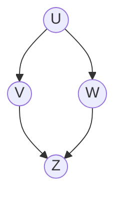
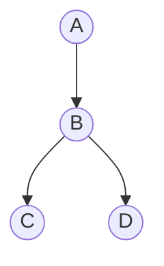

# GATE DA 2024 — Probability & Statistics PYQs
*(Sorted by Difficulty and Concept Depth)*

This compilation contains all **29 Probability and Statistics questions** from:
1. **GATE 2024 Data Science and Artificial Intelligence (DA)** — Official Question Paper (IISc Bengaluru)
2. **GATE 2024 Data Science and Artificial Intelligence (DA)** — Official Sample Paper (IISc Bengaluru)

---

## Difficulty & Concept Depth Overview

| Tier | Difficulty | Concept Depth | Description | Question Count |
|:---:|:---:|:---:|:---|:---:|
| **Tier 1** | **Easy** | **Level 1: Foundational & Direct Recall** | Direct formula application, elementary counting, basic probability axioms, and sample mean updates. | 9 Questions |
| **Tier 2** | **Medium** | **Level 2: Intermediate & Multi-Step** | Standard discrete/continuous distributions, independent events, Bayes' theorem, covariance, and parameter estimation. | 11 Questions |
| **Tier 3** | **Hard** | **Level 3: Advanced & Theoretical Rigor** | Multidimensional calculus, joint PDFs, Markov chains / stopping times, likelihood weighting, and statistical estimator properties. | 9 Questions |

---

## Detailed Question Matrix

| Sl. | Question Source & No. | Topic | Type | Marks | Difficulty | Concept Depth |
|:---:|:---|:---|:---:|:---:|:---:|:---:|
| 1 | **GATE DA 2024 — Q.11** | Poisson & Normal Distribution Properties | MCQ | 1 | Easy | Level 1 |
| 2 | **GATE DA 2024 — Q.12** | Independent Events & Sample Space ($T \cap S$) | MCQ | 1 | Easy | Level 1 |
| 3 | **GATE DA 2024 — Q.27** | Descriptive Statistics: Z-Score Normalization | MCQ | 1 | Easy | Level 1 |
| 4 | **GATE DA 2024 — Q.34** | Descriptive Statistics: Updating Sample Mean | NAT | 1 | Easy | Level 1 |
| 5 | **GATE DA 2024 — Q.7** | Classical Probability: Family with 3 Children | MCQ | 2 | Easy | Level 1 |
| 6 | **Sample Paper — Q.4** | Descriptive Statistics: Sample Mean Update | MCQ | 1 | Easy | Level 1 |
| 7 | **Sample Paper — Q.7** | Conditional Probability: Two Coin Flips | MCQ | 1 | Easy | Level 1 |
| 8 | **Sample Paper — Q.9** | Probability Axioms: Conditioning on Subset ($B \subset A$) | MCQ | 1 | Easy | Level 1 |
| 9 | **Sample Paper — Q.33** | Continuous Uniform Distribution: Variance | MCQ | 2 | Easy | Level 1 |
| 10 | **GATE DA 2024 — Q.3** | Counting: 4-digit Numbers Divisible by 3 | MCQ | 1 | Medium | Level 2 |
| 11 | **GATE DA 2024 — Q.20** | Naïve Bayes: Parameters for Binary Attributes | MCQ | 1 | Medium | Level 2 |
| 12 | **GATE DA 2024 — Q.57** | Exponential Distribution: Expectation & Variance | NAT | 2 | Medium | Level 2 |
| 13 | **GATE DA 2024 — Q.58** | Bayes' Theorem: Posterior Probability $P(T\|S)$ | NAT | 2 | Medium | Level 2 |
| 14 | **GATE DA 2024 — Q.65** | Covariance of Indicator Random Variables | NAT | 2 | Medium | Level 2 |
| 15 | **Sample Paper — Q.8** | Classical Probability: Particles in Boxes | MCQ | 1 | Medium | Level 2 |
| 16 | **Sample Paper — Q.10** | Uniform PDF over Disjoint Intervals: Expected Value | NAT | 1 | Medium | Level 2 |
| 17 | **Sample Paper — Q.20** | Descriptive Statistics: Pearson Correlation Coefficient | MCQ | 1 | Medium | Level 2 |
| 18 | **Sample Paper — Q.28** | Naïve Bayes: Parameters for Multi-Valued Attributes | MCQ | 1 | Medium | Level 2 |
| 19 | **Sample Paper — Q.45** | Law of Total Probability: Voting Transitions | NAT | 2 | Medium | Level 2 |
| 20 | **Sample Paper — Q.47** | Sample Space: Event Independence (MSQ) | MSQ | 2 | Medium | Level 2 |
| 21 | **GATE DA 2024 — Q.24** | Bayesian Networks: Conditional Independence & d-Separation | MCQ | 1 | Hard | Level 3 |
| 22 | **GATE DA 2024 — Q.36** | Markov Chains / Expected Stopping Time (Dice Rolls) | MCQ | 2 | Hard | Level 3 |
| 23 | **GATE DA 2024 — Q.56** | Continuous Joint Probability: $P(X \ge Y)$ for Uniform RVs | NAT | 2 | Hard | Level 3 |
| 24 | **GATE DA 2024 — Q.59** | Continuous Joint PDF: Conditional Expectation (MTA) | NAT | 2 | Hard | Level 3 |
| 25 | **GATE DA 2024 — Q.62** | Decision Trees: Information Gain & Entropy from Table | NAT | 2 | Hard | Level 3 |
| 26 | **GATE DA 2024 — Q.64** | Bayesian Networks: Exact Joint Probability from CPTs | NAT | 2 | Hard | Level 3 |
| 27 | **Sample Paper — Q.32** | Bayesian Networks: Likelihood Weighting Estimation | MCQ | 2 | Hard | Level 3 |
| 28 | **Sample Paper — Q.36** | Continuous Joint PDF: Conditional Density $f_{X\|Y}$ | MCQ | 2 | Hard | Level 3 |
| 29 | **Sample Paper — Q.53** | Estimation Theory: Unbiasedness vs. MLE ($\sigma^2, \sigma$) | MCQ | 2 | Hard | Level 3 |

---
---

# Tier 1: Foundational / Level 1 Concept Depth (Easy)
*Focus: Direct formula evaluation, basic counting, elementary probability axioms, and sample statistics.*

---

### 1. GATE DA 2024 — Question 11
- **Source:** GATE 2024 DA Official Paper
- **Section:** Data Science and Artificial Intelligence (DA)
- **Question Type:** Multiple Choice Question (MCQ)
- **Marks:** 1
- **Difficulty:** Easy | **Concept Depth:** Level 1 (Direct Recall)
- **Topic:** Poisson Distribution, Normal Distribution Properties

**Question:**
Consider the following statements:
- (i) The mean and variance of a Poisson random variable are equal.
- (ii) For a standard normal random variable, the mean is zero and the variance is one.

Which ONE of the following options is correct?

(A) Both (i) and (ii) are true  
(B) (i) is true and (ii) is false  
(C) (ii) is true and (i) is false  
(D) Both (i) and (ii) are false  

**Answer:**
**(A) Both (i) and (ii) are true**

**Detailed Solution:**
- Statement (i): For a Poisson random variable $X \sim \text{Poisson}(\lambda)$, the expected value $E[X] = \lambda$ and the variance $\text{Var}(X) = \lambda$. Hence, mean and variance are equal. Statement (i) is **True**.
- Statement (ii): By definition, a standard normal random variable $Z \sim \mathcal{N}(0, 1)$ has mean $\mu = 0$ and variance $\sigma^2 = 1$. Statement (ii) is **True**.

---

### 2. GATE DA 2024 — Question 12
- **Source:** GATE 2024 DA Official Paper
- **Section:** Data Science and Artificial Intelligence (DA)
- **Question Type:** Multiple Choice Question (MCQ)
- **Marks:** 1
- **Difficulty:** Easy | **Concept Depth:** Level 1 (Sample Space Analysis)
- **Topic:** Sample Space, Mutually Exclusive Events

**Question:**
Three fair coins are tossed independently. $T$ is the event that two or more tosses result in heads. $S$ is the event that two or more tosses result in tails.

What is the probability of the event $T \cap S$?

(A) 0  
(B) 0.5  
(C) 0.25  
(D) 1  

**Answer:**
**(A) 0**

**Detailed Solution:**
When tossing three fair coins, the total number of tosses is 3.  
- Event $T$: "Two or more tosses result in heads" $\implies$ Number of heads $\ge 2$: $\{HHT, HTH, THH, HHH\}$.
- Event $S$: "Two or more tosses result in tails" $\implies$ Number of tails $\ge 2$ (at most 1 head): $\{TTH, THT, HTT, TTT\}$.

Notice that $T$ requires at least 2 heads, while $S$ requires at least 2 tails (at most 1 head).  
A sequence of 3 tosses cannot simultaneously have $\ge 2$ heads AND $\ge 2$ tails.  
$$T \cap S = \emptyset \implies P(T \cap S) = 0$$

---

### 3. GATE DA 2024 — Question 27
- **Source:** GATE 2024 DA Official Paper
- **Section:** Data Science and Artificial Intelligence (DA)
- **Question Type:** Multiple Choice Question (MCQ)
- **Marks:** 1
- **Difficulty:** Easy | **Concept Depth:** Level 1 (Standard Formula)
- **Topic:** Descriptive Statistics, Z-Score Normalization

**Question:**
Let the minimum, maximum, mean and standard deviation values for the attribute income of data scientists be ₹46000, ₹170000, ₹96000, and ₹21000, respectively. The z-score normalized income value of ₹106000 is closest to which ONE of the following options?

(A) 0.217  
(B) 0.476  
(C) 0.623  
(D) 2.304  

**Answer:**
**(B) 0.476**

**Detailed Solution:**
The z-score normalization formula is:
$$z = \frac{x - \mu}{\sigma}$$
Given:
- Value $x = 106000$
- Mean $\mu = 96000$
- Standard deviation $\sigma = 21000$

Calculating:
$$z = \frac{106000 - 96000}{21000} = \frac{10000}{21000} = \frac{10}{21} \approx 0.47619$$

---

### 4. GATE DA 2024 — Question 34
- **Source:** GATE 2024 DA Official Paper
- **Section:** Data Science and Artificial Intelligence (DA)
- **Question Type:** Numerical Answer Type (NAT)
- **Marks:** 1
- **Difficulty:** Easy | **Concept Depth:** Level 1 (Mean Aggregation)
- **Topic:** Descriptive Statistics, Sample Mean

**Question:**
The sample average of 50 data points is 40. The updated sample average after including a new data point taking the value of 142 is ______.

**Answer:**
**42** (Answer range: 42 to 42)

**Detailed Solution:**
- Initial sample size $n = 50$, initial mean $\bar{x}_{50} = 40$.
- Initial sum of observations:
  $$\sum_{i=1}^{50} x_i = 50 \times 40 = 2000$$
- A new 51st data point $x_{51} = 142$ is added.
- New sum of observations:
  $$\sum_{i=1}^{51} x_i = 2000 + 142 = 2142$$
- Updated sample average:
  $$\bar{x}_{51} = \frac{2142}{51} = 42$$

---

### 5. GATE DA 2024 — Question 7
- **Source:** GATE 2024 DA Official Paper
- **Section:** General Aptitude (GA)
- **Question Type:** Multiple Choice Question (MCQ)
- **Marks:** 2
- **Difficulty:** Easy | **Concept Depth:** Level 1 (Elementary Probability)
- **Topic:** Classical Probability, Binomial Distribution

**Question:**
The probability of a boy or a girl being born is $1/2$. For a family having only three children, what is the probability of having two girls and one boy?

(A) $3/8$  
(B) $1/8$  
(C) $1/4$  
(D) $1/2$  

**Answer:**
**(A) 3/8**

**Detailed Solution:**
Let $n = 3$ children. Number of girls $X \sim \text{Binomial}(n=3, p=1/2)$:
$$P(X = 2) = \binom{3}{2} \left(\frac{1}{2}\right)^2 \left(\frac{1}{2}\right)^1 = 3 \times \frac{1}{8} = \frac{3}{8}$$

---

### 6. Sample Question 4
- **Source:** GATE 2024 DA Official Sample Paper (IISc)
- **Question Type:** Multiple Choice Question (MCQ)
- **Marks:** 1
- **Difficulty:** Easy | **Concept Depth:** Level 1 (Mean Aggregation)
- **Topic:** Descriptive Statistics, Sample Mean Update

**Question:**
The mean of the observations of the first 50 observations of a process is 12. If the 51st observation is 18, then, the mean of the first 51 observations of the process, rounded off to two decimal places is ______ .

(A) 12.01  
(B) 12.12  
(C) 12.36  
(D) 18.18  

**Answer:**
**(B) 12.12**

**Detailed Solution:**
- Sum of first 50 observations $= 50 \times 12 = 600$.
- With the 51st observation added, the new sum $= 600 + 18 = 618$.
- New mean $= \frac{618}{51} \approx 12.1176 \approx 12.12$.

---

### 7. Sample Question 7
- **Source:** GATE 2024 DA Official Sample Paper (IISc)
- **Question Type:** Multiple Choice Question (MCQ)
- **Marks:** 1
- **Difficulty:** Easy | **Concept Depth:** Level 1 (Conditioning on Reduced Space)
- **Topic:** Conditional Probability, Coin Tosses

**Question:**
A fair coin is flipped twice, and it is given that at least one tail has been observed. The probability of getting two tails is

(A) $\frac{1}{2}$  
(B) $\frac{1}{3}$  
(C) $\frac{2}{3}$  
(D) $\frac{1}{4}$  

**Answer:**
**(B) 1/3**

**Detailed Solution:**
Sample space $S = \{HH, HT, TH, TT\}$, each outcome with probability $1/4$.  
- Condition event $A$ (at least one tail): $A = \{HT, TH, TT\}$ ($|A| = 3$).
- Target event $B$ (two tails): $B = \{TT\}$.
$$P(B | A) = \frac{P(A \cap B)}{P(A)} = \frac{1/4}{3/4} = \frac{1}{3}$$

---

### 8. Sample Question 9
- **Source:** GATE 2024 DA Official Sample Paper (IISc)
- **Question Type:** Multiple Choice Question (MCQ)
- **Marks:** 1
- **Difficulty:** Easy | **Concept Depth:** Level 1 (Axiomatic Reasoning)
- **Topic:** Probability Axioms, Subset Conditioning

**Question:**
For two events $A$ and $B$, $B \subset A$, which one of the following is correct?

(A) $P(B | A) \ge P(B)$  
(B) $P(B | A) \le P(B)$  
(C) $P(A | B) < 1$  
(D) $P(A | B) = 0$  

**Answer:**
**(A) $P(B | A) \ge P(B)$**

**Detailed Solution:**
Since $B \subset A$, the intersection is $A \cap B = B$.
- By definition of conditional probability:
  $$P(B | A) = \frac{P(A \cap B)}{P(A)} = \frac{P(B)}{P(A)}$$
- Since $P(A) \le 1$, dividing $P(B)$ by a number $\le 1$ yields:
  $$P(B | A) = \frac{P(B)}{P(A)} \ge P(B)$$
- Note that $P(A | B) = \frac{P(A \cap B)}{P(B)} = \frac{P(B)}{P(B)} = 1$, making (C) and (D) false.

---

### 9. Sample Question 33
- **Source:** GATE 2024 DA Official Sample Paper (IISc)
- **Question Type:** Multiple Choice Question (MCQ)
- **Marks:** 2
- **Difficulty:** Easy | **Concept Depth:** Level 1 (Standard Moments)
- **Topic:** Continuous Uniform Distribution, Variance

**Question:**
$X$ is a uniformly distributed random variable from 0 to 1:
$$f(x) = \begin{cases} 1, & 0 \le x \le 1 \\ 0, & \text{otherwise} \end{cases}$$

The variance of $X$ is

(A) $\frac{1}{2}$  
(B) $\frac{1}{3}$  
(C) $\frac{1}{4}$  
(D) $\frac{1}{12}$  

**Answer:**
**(D) 1/12**

**Detailed Solution:**
For a uniform random variable $X \sim U[a, b]$, the variance is:
$$\text{Var}(X) = \frac{(b - a)^2}{12}$$
With $a = 0$ and $b = 1$:
$$\text{Var}(X) = \frac{(1 - 0)^2}{12} = \frac{1}{12}$$

---
---

# Tier 2: Intermediate / Level 2 Concept Depth (Medium)
*Focus: Distributional properties, multi-step probability calculus, Bayes' theorem, independence testing, covariance, and model parameter counts.*

---

### 10. GATE DA 2024 — Question 3
- **Source:** GATE 2024 DA Official Paper
- **Section:** General Aptitude (GA)
- **Question Type:** Multiple Choice Question (MCQ)
- **Marks:** 1
- **Difficulty:** Medium | **Concept Depth:** Level 2 (Combinatorial Number Theory)
- **Topic:** Counting (Permutations & Combinations), Divisibility

**Question:**
How many 4-digit positive integers divisible by 3 can be formed using only the digits $\{1, 3, 4, 6, 7\}$, such that no digit appears more than once in a number?

(A) 24  
(B) 48  
(C) 72  
(D) 12  

**Answer:**
**(B) 48**

**Detailed Solution:**
A number is divisible by 3 if and only if the sum of its digits is divisible by 3.  
Given digits: $\{1, 3, 4, 6, 7\}$.  
Sum of all 5 digits $= 1 + 3 + 4 + 6 + 7 = 21$ (divisible by 3).  
To form a 4-digit number without repetition, we exclude exactly one digit. To keep the remaining sum divisible by 3, the excluded digit must itself be divisible by 3.  
The digits divisible by 3 are **3** and **6**.
- **Case 1: Exclude 3.** Remaining digits: $\{1, 4, 6, 7\}$. Sum $= 18$. Permutations $= 4! = 24$.
- **Case 2: Exclude 6.** Remaining digits: $\{1, 3, 4, 7\}$. Sum $= 15$. Permutations $= 4! = 24$.

Total 4-digit numbers $= 24 + 24 = 48$.

---

### 11. GATE DA 2024 — Question 20
- **Source:** GATE 2024 DA Official Paper
- **Section:** Data Science and Artificial Intelligence (DA)
- **Question Type:** Multiple Choice Question (MCQ)
- **Marks:** 1
- **Difficulty:** Medium | **Concept Depth:** Level 2 (Model Degrees of Freedom)
- **Topic:** Naïve Bayes Classifier, Parameter Estimation

**Question:**
Given a dataset with $K$ binary-valued attributes (where $K > 2$) for a two-class classification task, the number of parameters to be estimated for learning a naïve Bayes classifier is

(A) $2^K + 1$  
(B) $2K + 1$  
(C) $2^{K+1} + 1$  
(D) $K^2 + 1$  

**Answer:**
**(B) $2K + 1$**

**Detailed Solution:**
1. **Class Prior $P(Y)$:**  
   Since there are 2 classes and $P(Y=c_1) + P(Y=c_2) = 1$, only **1 independent parameter** is needed.
2. **Conditional Probabilities $P(X_i | Y)$:**  
   Under the Naïve Bayes conditional independence assumption:
   $$P(X_1, \dots, X_K | Y = c) = \prod_{i=1}^K P(X_i | Y = c)$$
   For each feature $X_i \in \{0, 1\}$ and class $c \in \{c_1, c_2\}$, knowing $P(X_i = 1 | Y = c)$ automatically determines $P(X_i = 0 | Y = c)$. Thus, each feature requires 1 parameter per class.  
   For 2 classes and $K$ features: $2 \times K = 2K$ parameters.

**Total independent parameters to estimate:** $2K + 1$.

---

### 12. GATE DA 2024 — Question 57
- **Source:** GATE 2024 DA Official Paper
- **Section:** Data Science and Artificial Intelligence (DA)
- **Question Type:** Numerical Answer Type (NAT)
- **Marks:** 2
- **Difficulty:** Medium | **Concept Depth:** Level 2 (Continuous Moments)
- **Topic:** Exponential Distribution, Expectation, Variance

**Question:**
Let $X$ be a random variable exponentially distributed with parameter $\lambda > 0$. The probability density function of $X$ is given by:
$$f_X(x) = \begin{cases} \lambda e^{-\lambda x}, & x \ge 0 \\ 0, & \text{otherwise} \end{cases}$$

If $5 E(X) = \text{Var}(X)$, where $E(X)$ and $\text{Var}(X)$ indicate the expectation and variance of $X$, respectively, the value of $\lambda$ is ______ (rounded off to one decimal place).

**Answer:**
**0.2** (Answer range: 0.2 to 0.2)

**Detailed Solution:**
For an exponential random variable $X \sim \text{Exp}(\lambda)$:
$$E[X] = \frac{1}{\lambda}, \quad \text{Var}(X) = \frac{1}{\lambda^2}$$
Given $5 E(X) = \text{Var}(X)$:
$$5 \left(\frac{1}{\lambda}\right) = \frac{1}{\lambda^2} \implies 5\lambda = 1 \implies \lambda = \frac{1}{5} = 0.2$$

---

### 13. GATE DA 2024 — Question 58
- **Source:** GATE 2024 DA Official Paper
- **Section:** Data Science and Artificial Intelligence (DA)
- **Question Type:** Numerical Answer Type (NAT)
- **Marks:** 2
- **Difficulty:** Medium | **Concept Depth:** Level 2 (Bayes Inversion)
- **Topic:** Bayes' Theorem, Law of Total Probability

**Question:**
Consider two events $T$ and $S$. Let $\bar{T}$ denote the complement of the event $T$. The probability associated with different events are given as follows:
$$P(\bar{T}) = 0.6, \quad P(S | T) = 0.3, \quad P(S | \bar{T}) = 0.6$$

Then, $P(T | S)$ is ______ (rounded off to two decimal places).

**Answer:**
**0.25** (Answer range: 0.25 to 0.25)

**Detailed Solution:**
- $P(T) = 1 - P(\bar{T}) = 1 - 0.6 = 0.4$.
- By Law of Total Probability:
  $$P(S) = P(S | T) P(T) + P(S | \bar{T}) P(\bar{T}) = (0.3)(0.4) + (0.6)(0.6) = 0.12 + 0.36 = 0.48$$
- By Bayes' Theorem:
  $$P(T | S) = \frac{P(S | T) P(T)}{P(S)} = \frac{0.12}{0.48} = \frac{1}{4} = 0.25$$

---

### 14. GATE DA 2024 — Question 65
- **Source:** GATE 2024 DA Official Paper
- **Section:** Data Science and Artificial Intelligence (DA)
- **Question Type:** Numerical Answer Type (NAT)
- **Marks:** 2
- **Difficulty:** Medium | **Concept Depth:** Level 2 (Joint Indicator Moments)
- **Topic:** Indicator Random Variables, Covariance

**Question:**
Two fair coins are tossed independently. $X$ is a random variable that takes a value of 1 if both tosses are heads and 0 otherwise. $Y$ is a random variable that takes a value of 1 if at least one of the tosses is heads and 0 otherwise.

The value of the covariance of $X$ and $Y$ is ______ (rounded off to three decimal places).

**Answer:**
**0.0625** (Answer range: 0.062 to 0.063)

**Detailed Solution:**
Sample space: $\{HH, HT, TH, TT\}$, each with probability $1/4$.
- $X = 1$ for outcome $HH \implies P(X = 1) = \frac{1}{4} \implies E[X] = \frac{1}{4}$.
- $Y = 1$ for $\{HH, HT, TH\} \implies P(Y = 1) = \frac{3}{4} \implies E[Y] = \frac{3}{4}$.
- Product $XY = 1 \iff X = 1$ and $Y = 1 \iff HH \implies E[XY] = P(HH) = \frac{1}{4}$.

Covariance:
$$\text{Cov}(X, Y) = E[XY] - E[X]E[Y] = \frac{1}{4} - \left(\frac{1}{4} \times \frac{3}{4}\right) = \frac{1}{4} - \frac{3}{16} = \frac{1}{16} = 0.0625$$

---

### 15. Sample Question 8
- **Source:** GATE 2024 DA Official Sample Paper (IISc)
- **Question Type:** Multiple Choice Question (MCQ)
- **Marks:** 1
- **Difficulty:** Medium | **Concept Depth:** Level 2 (Classical Allocation)
- **Topic:** Counting, Permutations, Classical Probability

**Question:**
Given $n$ particles and $m$ ($> n$) boxes, we place each particle in one of the boxes uniformly at random. What is the probability that no box receives more than one particle?

(A) $\frac{n!}{(m - n)! m^n}$  
(B) $\frac{m!}{(m - n)! m^n}$  
(C) $\frac{1}{m^n}$  
(D) $\frac{(m - n)!}{m!}$  

**Answer:**
**(B) $\frac{m!}{(m - n)! m^n}$**

**Detailed Solution:**
- Total ways to place $n$ particles into $m$ boxes: $m^n$.
- Favorable ways where no box receives more than one particle: $P(m, n) = \frac{m!}{(m-n)!}$.
- Probability:
  $$P = \frac{\frac{m!}{(m-n)!}}{m^n} = \frac{m!}{(m - n)! m^n}$$

---

### 16. Sample Question 10
- **Source:** GATE 2024 DA Official Sample Paper (IISc)
- **Question Type:** Numerical Answer Type (NAT)
- **Marks:** 1
- **Difficulty:** Medium | **Concept Depth:** Level 2 (Disjoint Support Integration)
- **Topic:** Continuous Uniform Distribution, Expectation

**Question:**
$X$ is a random variable with support $[-2, 2] \cup [99.5, 100.5]$. The PDF of $X$ is such that it is equal to a constant $c$ inside its support and 0 outside. The expected value of $X$ is ________ .

**Answer:**
**20**

**Detailed Solution:**
Total length of support $= [2 - (-2)] + [100.5 - 99.5] = 4 + 1 = 5$.  
Since $\int f(x) dx = 1 \implies c \times 5 = 1 \implies c = 0.2$.  
$$E[X] = \int_{-2}^2 x \cdot c \, dx + \int_{99.5}^{100.5} x \cdot c \, dx = 0 + c \times (\text{length} \times \text{midpoint}) = 0.2 \times (1 \times 100) = 20$$

---

### 17. Sample Question 20
- **Source:** GATE 2024 DA Official Sample Paper (IISc)
- **Question Type:** Multiple Choice Question (MCQ)
- **Marks:** 1
- **Difficulty:** Medium | **Concept Depth:** Level 2 (Bivariate Descriptive Statistics)
- **Topic:** Descriptive Statistics, Pearson Correlation Coefficient

**Question:**
What is the Pearson’s correlation coefficient between $x$ and $y$ for the data in the table below? (rounded off to the first decimal place)

| $x$ | $y$ |
|:---:|:---:|
| -6 | 6.4 |
| 2 | 4.7 |
| 0.2 | 8 |
| 7 | 2 |
| -4 | 3.4 |

(A) -0.5  
(B) 0.5  
(C) 0.3  
(D) -0.3  

**Answer:**
**(A) -0.5**

**Detailed Solution:**
Sample size $n = 5$.
- $\sum x = -0.8 \implies \bar{x} = -0.16$
- $\sum y = 24.5 \implies \bar{y} = 4.9$
- $\sum (x - \bar{x})(y - \bar{y}) = \sum xy - n \bar{x}\bar{y} = -27.0 - 5(-0.16)(4.9) = -23.08$
- $\sum (x - \bar{x})^2 = 104.91, \quad \sum (y - \bar{y})^2 = 22.56$
$$r = \frac{-23.08}{\sqrt{104.91 \times 22.56}} = \frac{-23.08}{48.65} \approx -0.474 \approx -0.5$$

---

### 18. Sample Question 28
- **Source:** GATE 2024 DA Official Sample Paper (IISc)
- **Question Type:** Multiple Choice Question (MCQ)
- **Marks:** 1
- **Difficulty:** Medium | **Concept Depth:** Level 2 (General Model Parameterization)
- **Topic:** Naïve Bayes Classifier, Parameter Estimation

**Question:**
Given a $K$-class dataset containing $N$ points, where sample points are described using $D$ discrete features with each feature capable of taking $V$ values, how many parameters need to be estimated for Naïve Bayes Classifier?

(A) $V^K$  
(B) $K$  
(C) $VDK + K$  
(D) $K(V + D)$  

**Answer:**
**(C) $VDK + K$**

**Detailed Solution:**
- $K$ class priors: $P(Y = c)$ ($K$ parameters).
- For each class and each of $D$ features with $V$ values: $P(X_d = v | Y = c)$ ($V \times D \times K$ parameters).
- Total estimated parameters $= VDK + K$.

---

### 19. Sample Question 45
- **Source:** GATE 2024 DA Official Sample Paper (IISc)
- **Question Type:** Numerical Answer Type (NAT)
- **Marks:** 2
- **Difficulty:** Medium | **Concept Depth:** Level 2 (Partition Conditioning)
- **Topic:** Conditional Probability, Law of Total Probability

**Question:**
A class contains 60% of students who are incapable of changing their opinions about anything, and 40% of students are changing their minds at random, with probability 0.3, between subsequent votes on the same issue. Then, the probability of a student randomly chosen voted twice in the same way is _______.

**Answer:**
**0.88**

**Detailed Solution:**
- Group 1 (Fixed opinion, 60%): $P(\text{same} | G_1) = 1.0$.
- Group 2 (Changeable opinion, 40%): $P(\text{same} | G_2) = 1 - 0.3 = 0.70$.
$$P(\text{same}) = (1.0 \times 0.60) + (0.70 \times 0.40) = 0.60 + 0.28 = 0.88$$

---

### 20. Sample Question 47
- **Source:** GATE 2024 DA Official Sample Paper (IISc)
- **Question Type:** Multiple Select Question (MSQ)
- **Marks:** 2
- **Difficulty:** Medium | **Concept Depth:** Level 2 (Pairwise Independence Verification)
- **Topic:** Sample Space, Event Independence

**Question:**
Let $\{O_1, O_2, O_3, O_4\}$ represent the possible outcomes of a random experiment, with $\Pr(\{O_1\}) = \Pr(\{O_2\}) = \Pr(\{O_3\}) = \Pr(\{O_4\}) = \frac{1}{4}$. Consider the following events:
$$P = \{O_1, O_2\}, \quad Q = \{O_2, O_3\}, \quad R = \{O_3, O_4\}, \quad S = \{O_1, O_2, O_3\}$$

Then, which of the following statements are true?

(A) $P$ and $Q$ are independent  
(B) $P$ and $Q$ are not independent  
(C) $R$ and $S$ are independent  
(D) $Q$ and $S$ are not independent  

**Answer:**
**(A) and (D)**

**Detailed Solution:**
- $P(P) = P(Q) = P(R) = 1/2$, $P(S) = 3/4$.
- $P \cap Q = \{O_2\} \implies P(P \cap Q) = 1/4 = P(P)P(Q) \implies$ **Independent** ((A) is TRUE, (B) is FALSE).
- $R \cap S = \{O_3\} \implies P(R \cap S) = 1/4 \ne P(R)P(S) = 3/8 \implies$ **Dependent** ((C) is FALSE).
- $Q \cap S = \{O_2, O_3\} = Q \implies P(Q \cap S) = 1/2 \ne P(Q)P(S) = 3/8 \implies$ **Not independent** ((D) is TRUE).

---
---

# Tier 3: Advanced / Level 3 Concept Depth (Hard)
*Focus: d-separation / Bayesian networks, Markov renewal expectations, 2D continuous integrals, information theoretic entropy, and estimator theory.*

---

### 21. GATE DA 2024 — Question 24
- **Source:** GATE 2024 DA Official Paper
- **Section:** Data Science and Artificial Intelligence (DA)
- **Question Type:** Multiple Choice Question (MCQ)
- **Marks:** 1
- **Difficulty:** Hard | **Concept Depth:** Level 3 (d-Separation & Colliders)
- **Topic:** Joint Distribution, Conditional Independence, Bayesian Networks

**Question:**
Consider five random variables $U, V, W, X,$ and $Y$ whose joint distribution satisfies:
$$P(U, V, W, X, Y) = P(U) P(V) P(W | U, V) P(X | W) P(Y | W)$$

Which ONE of the following statements is FALSE?

(A) $Y$ is conditionally independent of $V$ given $W$  
(B) $X$ is conditionally independent of $U$ given $W$  
(C) $U$ and $V$ are conditionally independent given $W$  
(D) $Y$ and $X$ are conditionally independent given $W$  

**Answer:**
**(C) $U$ and $V$ are conditionally independent given $W$**

**Detailed Solution:**
The graph topology has a collider at $W$: $U \to W \leftarrow V$, with children $W \to X$ and $W \to Y$.
- (A) Path $Y \leftarrow W \leftarrow V$: blocked by conditioning on $W$. (TRUE)
- (B) Path $X \leftarrow W \leftarrow U$: blocked by conditioning on $W$. (TRUE)
- (C) $U$ and $V$ are marginally independent ($U \perp V$). Conditioning on the collider $W$ **opens** the path between $U$ and $V$ (explaining away). Thus $U \not\perp V \mid W$. Statement (C) is **FALSE**.
- (D) Path $X \leftarrow W \to Y$: blocked by conditioning on $W$. (TRUE)

---

### 22. GATE DA 2024 — Question 36
- **Source:** GATE 2024 DA Official Paper
- **Section:** Data Science and Artificial Intelligence (DA)
- **Question Type:** Multiple Choice Question (MCQ)
- **Marks:** 2
- **Difficulty:** Hard | **Concept Depth:** Level 3 (First-Step Analysis / Markov Chains)
- **Topic:** Expected Value, Geometric Trials, Markov Chains

**Question:**
A fair six-sided die (with faces numbered 1, 2, 3, 4, 5, 6) is repeatedly thrown independently.

What is the expected number of times the die is thrown until two consecutive throws of even numbers are seen?

(A) 2  
(B) 4  
(C) 6  
(D) 8  

**Answer:**
**(C) 6**

**Detailed Solution:**
Let $p = 1/2$ (even) and $q = 1/2$ (odd). Target pattern: **EE**.  
Using first-step analysis on Markov states:
- $E_0$: expected rolls from start (0 consecutive evens).
- $E_1$: expected rolls having just rolled 1 even.
- $E_2$: absorbing state (2 consecutive evens reached, $E_2 = 0$).

Equations:
$$E_0 = 1 + \frac{1}{2} E_1 + \frac{1}{2} E_0 \implies E_0 = 2 + E_1$$
$$E_1 = 1 + \frac{1}{2}(0) + \frac{1}{2} E_0 = 1 + \frac{1}{2} E_0$$

Substitute $E_1$:
$$E_0 = 2 + 1 + \frac{1}{2} E_0 = 3 + \frac{1}{2} E_0 \implies \frac{1}{2} E_0 = 3 \implies E_0 = 6$$

---

### 23. GATE DA 2024 — Question 56
- **Source:** GATE 2024 DA Official Paper
- **Section:** Data Science and Artificial Intelligence (DA)
- **Question Type:** Numerical Answer Type (NAT)
- **Marks:** 2
- **Difficulty:** Hard | **Concept Depth:** Level 3 (2D Geometric Probability Integration)
- **Topic:** Continuous Random Variables, Uniform Distribution, Joint Probability

**Question:**
Let $X$ be a random variable uniformly distributed in the interval $[1, 3]$ and $Y$ be a random variable uniformly distributed in the interval $[2, 4]$. If $X$ and $Y$ are independent of each other, the probability $P(X \ge Y)$ is ______ (rounded off to three decimal places).

**Answer:**
**0.125** (Answer range: 0.125 to 0.125)

**Detailed Solution:**
- $f_X(x) = 1/2$ on $[1, 3]$ and $f_Y(y) = 1/2$ on $[2, 4]$.
- Joint PDF: $f_{X,Y}(x, y) = 1/4$ on $[1, 3] \times [2, 4]$ (total rectangular area $= 4$).
- Region $X \ge Y$: Since $Y \ge 2$, $X$ must be $\ge 2$. Thus $2 \le x \le 3$ and $2 \le y \le x$.
- Area of this triangular region with vertices $(2, 2), (3, 2), (3, 3)$:
  $$\text{Area} = \frac{1}{2} \times \text{base} \times \text{height} = \frac{1}{2} \times 1 \times 1 = \frac{1}{2}$$
- Probability:
  $$P(X \ge Y) = \iint f_{X,Y} \, dy \, dx = \frac{1}{4} \times \frac{1}{2} = \frac{1}{8} = 0.125$$

---

### 24. GATE DA 2024 — Question 59
- **Source:** GATE 2024 DA Official Paper
- **Section:** Data Science and Artificial Intelligence (DA)
- **Question Type:** Numerical Answer Type (NAT)
- **Marks:** 2
- **Difficulty:** Hard | **Concept Depth:** Level 3 (Continuous Conditional PDF)
- **Topic:** Continuous Joint PDF, Conditional Expectation

**Question:**
Consider a joint probability density function of two random variables $X$ and $Y$:
$$f_{X,Y}(x, y) = \begin{cases} 2xy, & 0 < x < 2, \; 0 < y < x \\ 0, & \text{otherwise} \end{cases}$$

Then, $E[Y | X = 1.5]$ is ______.

**Official Final Key:**
**MTA (Marks to All)**

**Detailed Solution & Explanation for MTA:**
1. **Official Status:** IISc declared Marks to All because the total volume does not integrate to 1:
   $$\int_0^2 \int_0^x 2xy \, dy \, dx = \int_0^2 x^3 \, dx = \left[ \frac{x^4}{4} \right]_0^2 = 4 \ne 1$$
2. **Conditional Expectation Evaluation (using $f_{Y|X}$ definition):**
   $$f_X(x) = \int_0^x 2xy \, dy = x^3 \implies f_{Y|X}(y|x) = \frac{2xy}{x^3} = \frac{2y}{x^2} \quad (0 < y < x)$$
   $$E[Y | X = x] = \int_0^x y \cdot \frac{2y}{x^2} \, dy = \frac{2}{x^2} \left[ \frac{y^3}{3} \right]_0^x = \frac{2}{3} x$$
   At $x = 1.5$:
   $$E[Y | X = 1.5] = \frac{2}{3} \times 1.5 = 1.0$$

---

### 25. GATE DA 2024 — Question 62
- **Source:** GATE 2024 DA Official Paper
- **Section:** Data Science and Artificial Intelligence (DA)
- **Question Type:** Numerical Answer Type (NAT)
- **Marks:** 2
- **Difficulty:** Hard | **Concept Depth:** Level 3 (Information Theory & Empirical Entropy)
- **Topic:** Information Gain, Entropy, Decision Trees

**Question:**
Details of ten international cricket games between two teams “Green” and “Blue” are given in Table C. The attribute Pitch can take one of two values: spin-friendly ($S$) or pace-friendly ($F$). The attribute Format can take one of two values: one-day match ($O$) or test match ($T$).

To develop a decision-tree model, the computed $\text{InformationGain}(C, \text{Pitch})$ with respect to the Target is ______ (rounded off to two decimal places).

#### Table C:
| Match Number | Pitch | Format | Winner (Target) |
|:---:|:---:|:---:|:---:|
| 1 | $S$ | $T$ | Green |
| 2 | $S$ | $T$ | Blue |
| 3 | $F$ | $O$ | Blue |
| 4 | $S$ | $O$ | Blue |
| 5 | $F$ | $T$ | Green |
| 6 | $F$ | $O$ | Blue |
| 7 | $S$ | $O$ | Green |
| 8 | $F$ | $T$ | Blue |
| 9 | $F$ | $O$ | Blue |
| 10 | $S$ | $O$ | Green |

**Answer:**
**0.12** (Answer range: 0.12 to 0.13)

**Detailed Solution:**
- Target counts ($N = 10$): Green $= 4$, Blue $= 6$.
  $$H(C) = - [0.4 \log_2 0.4 + 0.6 \log_2 0.6] \approx 0.9710 \text{ bits}$$
- Split on Pitch:
  - Pitch = $S$ (5 matches: 3 Green, 2 Blue):
    $$H(C | S) = - [0.6 \log_2 0.6 + 0.4 \log_2 0.4] \approx 0.9710 \text{ bits}$$
  - Pitch = $F$ (5 matches: 1 Green, 4 Blue):
    $$H(C | F) = - [0.2 \log_2 0.2 + 0.8 \log_2 0.8] \approx 0.7219 \text{ bits}$$
- Conditional Entropy:
  $$H(C | \text{Pitch}) = 0.5(0.9710) + 0.5(0.7219) = 0.8465 \text{ bits}$$
- Information Gain:
  $$\text{Gain}(C, \text{Pitch}) = 0.9710 - 0.8465 = 0.1245 \approx 0.12$$

---

### 26. GATE DA 2024 — Question 64
- **Source:** GATE 2024 DA Official Paper
- **Section:** Data Science and Artificial Intelligence (DA)
- **Question Type:** Numerical Answer Type (NAT)
- **Marks:** 2
- **Difficulty:** Hard | **Concept Depth:** Level 3 (Graphical Model Factorization)
- **Topic:** Bayesian Networks, Joint Probability

**Question:**
Given the following Bayesian Network consisting of four Bernoulli random variables and the associated conditional probability tables:

#### Conditional Probability Tables:
- **Table for $U$:** $P(U = 0) = 0.5, \quad P(U = 1) = 0.5$
- **Table for $V | U$:** $P(V = 0 | U) = 0.5, \quad P(V = 1 | U) = 0.5$ (for both $U=0$ and $U=1$)
- **Table for $W | U$:**
  | $U$ | $P(W = 0 | U)$ | $P(W = 1 | U)$ |
  |:---:|:---:|:---:|
  | $U = 0$ | 1.0 | 0.0 |
  | $U = 1$ | 0.0 | 1.0 |
- **Table for $Z | V, W$:**
  | $V$ | $W$ | $P(Z = 0 | V, W)$ | $P(Z = 1 | V, W)$ |
  |:---:|:---:|:---:|:---:|
  | 0 | 0 | 0.5 | 0.5 |
  | 0 | 1 | 1.0 | 0.0 |
  | 1 | 0 | 1.0 | 0.0 |
  | 1 | 1 | 0.5 | 0.5 |

The value of $P(U = 1, V = 1, W = 1, Z = 1) =$ ______ (rounded off to three decimal places).

**Answer:**
**0.125** (Answer range: 0.125 to 0.125)

**Detailed Solution:**
Chain rule for the Bayesian network:
$$P(U = 1, V = 1, W = 1, Z = 1) = P(U = 1) \cdot P(V = 1 | U = 1) \cdot P(W = 1 | U = 1) \cdot P(Z = 1 | V = 1, W = 1)$$
$$= 0.5 \times 0.5 \times 1.0 \times 0.5 = 0.125$$

---

### 27. Sample Question 32
- **Source:** GATE 2024 DA Official Sample Paper (IISc)
- **Question Type:** Multiple Choice Question (MCQ)
- **Marks:** 2
- **Difficulty:** Hard | **Concept Depth:** Level 3 (MCMC Approximate Inference)
- **Topic:** Bayesian Networks, Likelihood Weighting

**Question:**
Consider the Bayes Net containing four Boolean random variables $(A, B, C, D)$, with convention:
$$A = \text{True} \implies A = a, \quad A = \text{False} \implies A = \neg a$$
and similarly for other variables.

#### Conditional Probability Tables:
- $P(a) = 1/5, \; P(\neg a) = 4/5$
- $P(b|a) = 1/5, \; P(b|\neg a) = 1/2, \; P(\neg b|a) = 4/5, \; P(\neg b|\neg a) = 1/2$
- $P(c|b) = 3/5, \; P(c|\neg b) = 2/5, \; P(\neg c|b) = 2/5, \; P(\neg c|\neg b) = 3/5$
- $P(d|b) = 1/2, \; P(d|\neg b) = 4/5, \; P(\neg d|b) = 1/2, \; P(\neg d|\neg b) = 1/5$

Samples generated with evidence $A = \neg a$ and $C = \neg c$:
- $s_1: (\neg a, \neg b, \neg c, \neg d)$
- $s_2: (\neg a, b, \neg c, \neg d)$
- $s_3: (\neg a, \neg b, \neg c, d)$
- $s_4: (\neg a, b, \neg c, d)$

Estimate the likelihood weight of each sample and thereby estimate $P(b | \neg a, \neg c)$.

(A) $s_1: 0.48, \; s_2: 0.32, \; s_3: 0.48, \; s_4: 0.32, \; P(b | \neg a, \neg c) = 0.4$  
(B) $s_1: 0.48, \; s_2: 0.32, \; s_3: 0.48, \; s_4: 0.32, \; P(b | \neg a, \neg c) = 0.64$  
(C) $s_1: 0.32, \; s_2: 0.48, \; s_3: 0.48, \; s_4: 0.32, \; P(b | \neg a, \neg c) = 0.64$  
(D) $s_1: 0.48, \; s_2: 0.32, \; s_3: 0.32, \; s_4: 0.32, \; P(b | \neg a, \neg c) = 0.4$  

**Answer:**
**(A) $s_1: 0.48, \; s_2: 0.32, \; s_3: 0.48, \; s_4: 0.32, \; P(b | \neg a, \neg c) = 0.4$**

**Detailed Solution:**
Likelihood weight:
$$w(s) = P(A = \neg a) \times P(C = \neg c | B)$$
- For $s_1, s_3$ ($B = \neg b$):
  $$w = P(\neg a) \times P(\neg c | \neg b) = 0.8 \times \frac{3}{5} = 0.48$$
- For $s_2, s_4$ ($B = b$):
  $$w = P(\neg a) \times P(\neg c | b) = 0.8 \times \frac{2}{5} = 0.32$$
Normalized estimate:
$$P(b | \neg a, \neg c) = \frac{w(s_2) + w(s_4)}{w(s_1) + w(s_2) + w(s_3) + w(s_4)} = \frac{0.32 + 0.32}{0.48 + 0.32 + 0.48 + 0.32} = \frac{0.64}{1.60} = 0.4$$

---

### 28. Sample Question 36
- **Source:** GATE 2024 DA Official Sample Paper (IISc)
- **Question Type:** Multiple Choice Question (MCQ)
- **Marks:** 2
- **Difficulty:** Hard | **Concept Depth:** Level 3 (Continuous Conditional Density)
- **Topic:** Joint Continuous PDF, Conditional PDF

**Question:**
Consider the following joint distribution of random variables $X$ and $Y$:
$$f(x, y) = \begin{cases} \frac{x(1 + 3y^2)}{4}, & 0 \le x \le 2, \; 0 \le y \le 1 \\ 0, & \text{otherwise} \end{cases}$$

Which of the following is the conditional pdf of $X | Y$?

(A) $\frac{x}{4}$  
(B) $\frac{y}{4}$  
(C) $\frac{x}{2}$  
(D) $\frac{y}{2}$  

**Answer:**
**(C) $x/2$**

**Detailed Solution:**
Marginal pdf of $Y$:
$$f_Y(y) = \int_{x=0}^2 \frac{x(1 + 3y^2)}{4} \, dx = \frac{1 + 3y^2}{4} \left[ \frac{x^2}{2} \right]_0^2 = \frac{1 + 3y^2}{2}$$
Conditional pdf:
$$f_{X|Y}(x | y) = \frac{f(x, y)}{f_Y(y)} = \frac{\frac{x(1 + 3y^2)}{4}}{\frac{1 + 3y^2}{2}} = \frac{x}{2} \quad (0 \le x \le 2)$$

---

### 29. Sample Question 53
- **Source:** GATE 2024 DA Official Sample Paper (IISc)
- **Question Type:** Multiple Choice Question (MCQ)
- **Marks:** 2
- **Difficulty:** Hard | **Concept Depth:** Level 3 (Mathematical Statistics & Estimator Theory)
- **Topic:** Estimation Theory, Unbiasedness, Maximum Likelihood Estimator (MLE)

**Question:**
Let $S^2$ be the variance of a random sample of size $n > 1$ from a normal population with an unknown mean $\mu$ and an unknown finite variance $\sigma^2$. Consider the following statements:
- (I) $S^2$ is an unbiased estimator of $\sigma^2$, and $S$ is an unbiased estimator of $\sigma$.
- (II) $\frac{n-1}{n} S^2$ is a maximum likelihood estimator of $\sigma^2$, and $\sqrt{\frac{n-1}{n}} S$ is a maximum likelihood estimator of $\sigma$.

Which of the above statements is true?

(A) (I) only  
(B) (II) only  
(C) Both (I) and (II)  
(D) Neither (I) nor (II)  

**Answer:**
**(B) (II) only**

**Detailed Solution:**
- **Statement (I):** While $E[S^2] = \sigma^2$ (making $S^2$ unbiased for $\sigma^2$), by Jensen's inequality and properties of the Chi distribution, $E[S] = E[\sqrt{S^2}] < \sqrt{E[S^2]} = \sigma$. Thus $S$ is **biased** for $\sigma$. (FALSE)
- **Statement (II):** The MLE of variance for a normal distribution is $\hat{\sigma}^2_{\text{MLE}} = \frac{1}{n} \sum (X_i - \bar{X})^2 = \frac{n-1}{n} S^2$. By the **functional invariance property of MLEs**, the MLE of $\sigma = \sqrt{\sigma^2}$ is $\sqrt{\hat{\sigma}^2_{\text{MLE}}} = \sqrt{\frac{n-1}{n}} S$. (TRUE)
